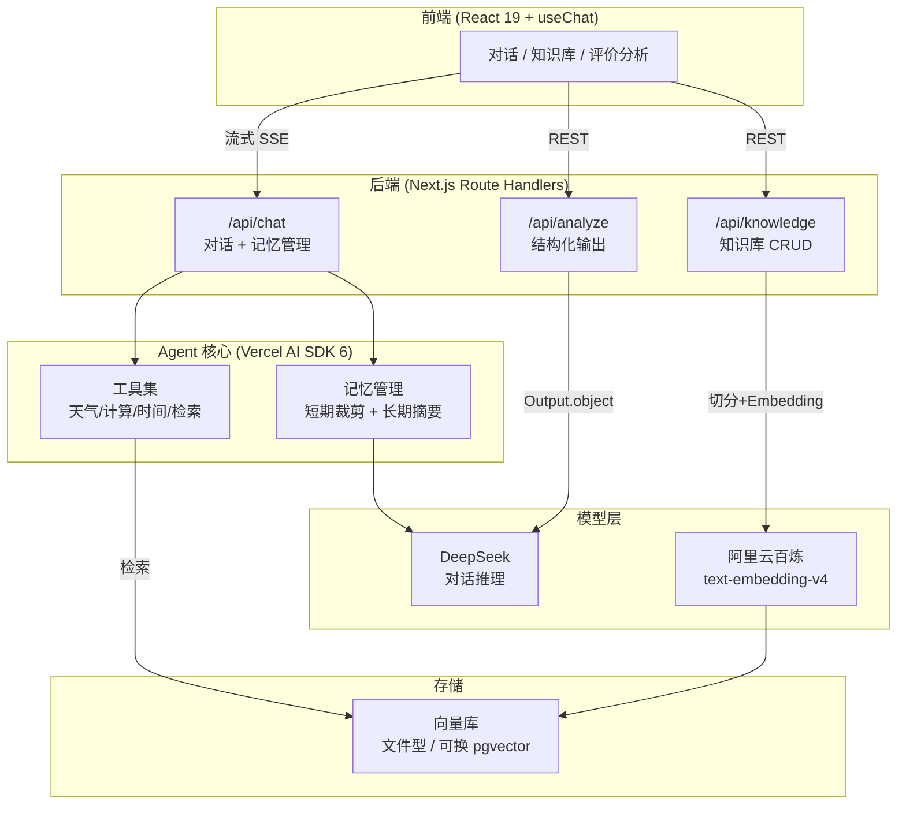

# AI Agent Lab

一个基于 Next.js + Vercel AI SDK 的 AI Agent 全栈应用，完整实现了 **Tool Calling、RAG、Structured Output、Memory** 四大核心能力。从对话、知识库到评价分析，覆盖了企业级 AI 应用的典型场景。

> 这是为转型 AI 方向的前端工程师设计的实战项目，每个功能都对应真实业务场景和面试高频考点。

## 核心能力

| 能力 | 场景 | 涉及技术 |
|------|------|----------|
| **Agent 对话** | 多工具协作的智能助手 | Stream、Tool Calling、`stepCountIs` 多步推理 |
| **RAG 知识库** | Agentic RAG（检索作为工具，非强制检索） | Embedding、向量检索、余弦相似度、引用来源 |
| **Structured Output** | 用户评价情感分析 | Zod Schema、约束解码、类型安全输出 |
| **Memory 记忆** | 长对话上下文管理 | `pruneMessages` 裁剪、摘要压缩、token 优化 |

## 架构图



## 技术栈

**前端**：Next.js (App Router) · React 19 · TypeScript · Tailwind CSS · shadcn/ui · ai-elements

**后端**：Next.js Route Handlers · Server Components

**AI**：Vercel AI SDK 6（`streamText` / `tool` / `generateText` / `Output.object` / `pruneMessages`）· DeepSeek（对话）· 阿里云百炼 text-embedding-v4（Embedding）

**工程化**：pnpm · Turbopack · Git

## 快速开始

### 环境变量

在项目根目录创建 `.env.local`：

```env
# 对话模型（DeepSeek，OpenAI 兼容协议）
DEEPSEEK_API_KEY=sk-xxxxxxxx

# 向量模型（阿里云百炼 DashScope，OpenAI 兼容协议）
DASHSCOPE_API_KEY=sk-xxxxxxxx
```

### 安装与运行

```bash
pnpm install
pnpm dev
```

打开 [http://localhost:3000](http://localhost:3000)，从首页进入各功能。

## 项目结构

```
src/
├── app/
│   ├── api/
│   │   ├── chat/          # Agent 对话 + 记忆管理
│   │   ├── knowledge/     # 知识库 CRUD（上传/删除/列表）
│   │   └── analyze/       # Structured Output（评价分析）
│   ├── chat/              # 对话页面（Tool 渲染 + 记忆面板）
│   ├── knowledge/         # 知识库管理页面
│   └── analyze/           # 评价分析页面
├── components/
│   ├── site-nav.tsx       # 全局导航
│   ├── ai-elements/       # 对话/消息/工具 UI 组件
│   └── ui/                # shadcn/ui 基础组件
└── lib/
    ├── tools/             # 工具集（Agent 的"手"）
    ├── memory.ts          # 记忆管理（短期裁剪 + 长期摘要）
    ├── rag.ts             # RAG（切分 + 检索 + 来源格式化）
    ├── vector-store.ts    # 向量库（余弦相似度 + CRUD）
    ├── providers.ts       # 百炼 Embedding provider
    └── schemas/           # Zod Schema 定义
```

## 关键技术决策

**Agentic RAG 而非强制检索** — 知识库检索作为工具交给模型自主判断，而不是每次提问都无脑检索。这是企业主流方案，避免了闲聊/常识问题浪费检索成本。

**文件型向量库，生产可换 pgvector** — 零基础设施快速验证，接口设计成 `addChunks` / `search` / `deleteDocument`，迁移到 PostgreSQL + pgvector 只需替换 `vector-store.ts` 一个文件。

**AI SDK 6 的 `generateText` + `Output.object`** — 而非已废弃的 `generateObject`。Structured Output 通过 Zod Schema 约束解码 + 运行时校验，保证前端拿到类型安全的数据。

**记忆管理分两层** — 短期用 `pruneMessages` 剥离旧工具结果省 token（无损瘦身），长期用模型摘要压缩超长对话（有损但保要点）。

**百炼 Embedding 分批处理** — `text-embedding-v4` 单批上限 10 条，`ingestDocument` 按批调用 `embedMany` 合并结果，大文档也能稳定入库。

## 面试亮点

- **多步工具调用**：`stopWhen: stepCountIs(5)` 让 Agent 能"调工具 → 看结果 → 再调工具"循环推理
- **Agentic RAG**：检索作为工具自主触发，闲聊不检索、业务问题才检索（面试高频区分点）
- **Structured Output**：Zod Schema → JSON Schema 约束解码 → 运行时校验，前端零 `any`
- **记忆可视化**：`data-memory` stream part 把记忆系统的处理过程（原始→压缩条数、是否摘要）实时展示在前端
- **引用来源**：RAG 回答末尾标注 `参考资料：《文档标题》`，让输出可追溯

## License

MIT
